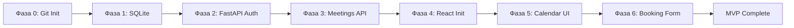

# PLAN.md — План фаз разработки MeetManager

> **Версия:** 1.1  
> **Удалённый репозиторий:** https://github.com/4il228/MeetManager  
> **Правило:** фаза **N** начинается только после merge/push фазы **N−1** в `main`.

---

## Общая схема пайплайна



| Фаза | Ветка | Агент | Артефакт отчёта |
|------|-------|-------|-----------------|
| 0 | `phase/0-git-init` | DevOps Agent | `docs/phases/PHASE-0.md` |
| 1 | `phase/1-database` | Backend / DB Agent | `docs/phases/PHASE-1.md` |
| 2 | `phase/2-auth` | Backend / Auth Agent | `docs/phases/PHASE-2.md` |
| 3 | `phase/3-meetings` | Backend Core Agent | `docs/phases/PHASE-3.md` |
| 4 | `phase/4-frontend-init` | Frontend / DevOps Agent | `docs/phases/PHASE-4.md` |
| 5 | `phase/5-calendar-ui` | Frontend UI Agent | `docs/phases/PHASE-5.md` |
| 6 | `phase/6-booking-form` | Frontend Feature Agent | `docs/phases/PHASE-6.md` |

---

## Протокол завершения фазы (обязателен для каждой фазы)

Выполнить **строго в указанном порядке**:

1. **Реализация** — все пункты «Критерии приёмки» выполнены.
2. **Самопроверка** — команды из блока «Верификация» проходят без ошибок.
3. **Отчёт** — создать/обновить `docs/phases/PHASE-N.md`:
   - что сделано (список файлов);
   - команды верификации и их вывод;
   - известные ограничения (если есть).
4. **Git commit:**
   ```bash
   git add -A
   git commit -m "feat(phase-N): краткое описание результата фазы"
   ```
5. **Push и merge:**
   ```bash
   git push -u origin phase/N-имя
   # После ревью (или автоматически для MVP):
   git checkout main
   git merge phase/N-имя --no-ff -m "merge: phase N — краткое имя"
   git push origin main
   ```
6. **Тег (опционально, рекомендуется):** `git tag -a v0.N.0 -m "Phase N complete" && git push origin v0.N.0`

---

## Фаза 0: Инициализация Git-репозитория

| | |
|---|---|
| **Исполнитель** | DevOps Agent |
| **Контекст** | `SPEC.md` §3.2, §3.3, §8.3 |
| **Зависимости** | Нет |
| **Ветка** | `phase/0-git-init` |

### Deliverables (точные пути)

- [ ] `git init` в корне проекта
- [ ] `origin` → `https://github.com/4il228/MeetManager.git`
- [ ] Ветка `main` создана и запушена
- [ ] `.gitignore` по SPEC §8.3
- [ ] `README.md` — название, стек, ссылки на SPEC/PLAN/AGENTS, команды запуска (заглушки)
- [ ] `docs/phases/` — каталог для отчётов
- [ ] `backend/.env.example`, `frontend/.env.example` (шаблоны из SPEC §8)

### Критерии приёмки

- [ ] `git remote -v` показывает `origin` → GitHub URL
- [ ] `git branch` — активна `main`
- [ ] Секреты и `.db` не отслеживаются git
- [ ] Первый push на `main` успешен

### Верификация

```bash
git status
git remote -v
git log --oneline -3
git ls-files | findstr /i "\.env \.db"   # Windows
# Ожидание: пустой вывод (файлы не в индексе)
```

---

## Фаза 1: Инициализация БД и схемы (SQLite)

| | |
|---|---|
| **Исполнитель** | Backend / DB Agent |
| **Контекст** | `SPEC.md` §4 |
| **Зависимости** | Фаза 0 |
| **Ветка** | `phase/1-database` |

### Deliverables

- [ ] `backend/scripts/init_db.py` — создание таблиц по DDL
- [ ] `backend/scripts/seed.py` — 4 тестовых пользователя (SPEC §4.4)
- [ ] `backend/data/` — каталог (в .gitignore)
- [ ] Прагмы WAL, busy_timeout, foreign_keys

### Критерии приёмки

- [ ] Таблицы `users`, `meetings`, `meeting_participants` созданы
- [ ] UUID и `created_at` генерируются дефолтами
- [ ] Seed идемпотентен
- [ ] `docs/phases/PHASE-1.md` создан
- [ ] Commit + push + merge в `main`

### Верификация

```bash
cd backend
python scripts/init_db.py
python scripts/seed.py
python -c "import sqlite3; c=sqlite3.connect('data/meetmanager.db'); print(c.execute('SELECT count(*) FROM users').fetchone())"
# Ожидание: (4,)
```

---

## Фаза 2: FastAPI и безопасность (Auth)

| | |
|---|---|
| **Исполнитель** | Backend / Auth Agent |
| **Контекст** | `SPEC.md` §5.1, §6 |
| **Зависимости** | Фаза 1 |
| **Ветка** | `phase/2-auth` |

### Deliverables

- [ ] `backend/app/main.py`, `config.py`, `database.py`
- [ ] `backend/app/routers/auth.py`
- [ ] `backend/app/schemas/auth.py`
- [ ] `backend/app/services/auth.py` (bcrypt, JWT)
- [ ] `slowapi` rate limit на login
- [ ] `pyproject.toml` или `requirements.txt`

### Критерии приёмки

- [ ] `POST /api/v1/auth/login` — 200 + cookies
- [ ] Неверный пароль → 401 с абстрактным сообщением
- [ ] 6-й login за минуту → 429
- [ ] `GET /api/v1/auth/me` — профиль по cookie
- [ ] `POST /api/v1/auth/logout` — очистка cookie
- [ ] Commit + push + merge

### Верификация

```bash
cd backend
uvicorn app.main:app --reload
# В другом терминале:
curl -X POST http://localhost:8000/api/v1/auth/login -H "Content-Type: application/json" -d "{\"username\":\"ivanov\",\"password\":\"User123!\"}" -c cookies.txt -v
curl http://localhost:8000/api/v1/auth/me -b cookies.txt
```

---

## Фаза 3: Логика встреч и блокировок

| | |
|---|---|
| **Исполнитель** | Backend Core Agent |
| **Контекст** | `SPEC.md` §5.2–5.3, §7 |
| **Зависимости** | Фаза 2 |
| **Ветка** | `phase/3-meetings` |

### Deliverables

- [ ] `backend/app/routers/users.py`, `meetings.py`
- [ ] `backend/app/schemas/meeting.py`, `user.py`
- [ ] `backend/app/services/meetings.py` (BEGIN IMMEDIATE, overlap check)
- [ ] Pydantic-валидаторы (HTML strip, интервалы)

### Критерии приёмки

- [ ] Все эндпоинты §5.2–5.3 работают
- [ ] Пересечение → 409 с массивом `conflicts`
- [ ] DELETE только для автора
- [ ] `start_time` в прошлом → 422
- [ ] Commit + push + merge

### Верификация

```bash
# После login (cookies.txt):
curl "http://localhost:8000/api/v1/users?search=иван" -b cookies.txt
curl -X POST http://localhost:8000/api/v1/meetings -H "Content-Type: application/json" -b cookies.txt -d "{\"title\":\"Test\",\"start_time\":\"2026-12-01T10:00:00Z\",\"end_time\":\"2026-12-01T11:00:00Z\",\"participant_ids\":[]}"
# Повтор с пересекающимся интервалом → 409
```

---

## Фаза 4: Инициализация фронтенда (React, Tailwind, PWA)

| | |
|---|---|
| **Исполнитель** | Frontend / DevOps Agent |
| **Контекст** | `SPEC.md` §3.1, §3.2 |
| **Зависимости** | Фаза 3 (API готов) |
| **Ветка** | `phase/4-frontend-init` |

### Deliverables

- [ ] `frontend/` — Vite + React 19 + Tailwind
- [ ] `frontend/public/manifest.json`, `sw.js`
- [ ] `frontend/src/context/AuthContext.tsx`
- [ ] `frontend/src/api/client.ts` — Axios, `withCredentials: true`
- [ ] Proxy/dev: API на `localhost:8000`

### Критерии приёмки

- [ ] `npm run dev` — приложение на `:5173`
- [ ] `npm run build` — без ошибок
- [ ] Manifest валиден, Service Worker регистрируется
- [ ] AuthContext: login/logout/me
- [ ] Commit + push + merge

### Верификация

```bash
cd frontend
npm install
npm run build
npm run dev
# Открыть http://localhost:5173 — заглушка или login route
```

---

## Фаза 5: Адаптивный UI календаря (Mobile-First)

| | |
|---|---|
| **Исполнитель** | Frontend UI Agent |
| **Контекст** | `SPEC.md` §2.1–2.2, §7.2, §7.4 |
| **Зависимости** | Фаза 4 |
| **Ветка** | `phase/5-calendar-ui` |
| **MCP** | **Обязательно** `user-stitch` для всех UI-компонентов |

### Deliverables

- [ ] `frontend/src/pages/LoginPage.tsx`
- [ ] `frontend/src/pages/CalendarPage.tsx`
- [ ] `frontend/src/components/DayView.tsx`, `WeekView.tsx`
- [ ] `frontend/src/components/ColleagueSearch.tsx`
- [ ] `frontend/src/components/SkeletonCalendar.tsx`
- [ ] Свайп-навигация (день/неделя)

### Критерии приёмки

- [ ] Login form — touch ≥ 44px
- [ ] Режимы День/Неделя переключаются
- [ ] Все метки времени на таймлайне и в карточках — **в МСК** (`Europe/Moscow`), с подписью «МСК» (SPEC §7.2)
- [ ] Поиск коллег меняет `user_id` в запросе meetings
- [ ] Skeleton при смене даты
- [ ] Дизайн сгенерирован через `user-stitch` (ссылки на stitch session в PHASE-5.md)
- [ ] Commit + push + merge

### Верификация

```bash
cd frontend && npm run dev
# Ручная проверка на viewport 375px (Chrome DevTools)
# Login → календарь → свайп → поиск коллеги
```

---

## Фаза 6: Форма бронирования

| | |
|---|---|
| **Исполнитель** | Frontend Feature Agent |
| **Контекст** | `SPEC.md` §2.3, §7.2 |
| **Зависимости** | Фаза 5 |
| **Ветка** | `phase/6-booking-form` |
| **MCP** | **Обязательно** `user-stitch` для модалок, FAB, Toast |

### Deliverables

- [ ] `frontend/src/components/FabButton.tsx`
- [ ] `frontend/src/components/MeetingFormModal.tsx`
- [ ] `frontend/src/components/ConflictModal.tsx`
- [ ] `frontend/src/components/Toast.tsx`
- [ ] `frontend/src/hooks/useDebounce.ts`
- [ ] Интеграция `date-fns` + `@date-fns/tz` (UTC ↔ **МСК**, зона `Europe/Moscow`)

### Критерии приёмки

- [ ] FAB и клик по слоту открывают форму
- [ ] Debounce check-availability, busy подсвечены красным
- [ ] Native datetime-local / time inputs; введённое время трактуется как **МСК** и конвертируется в UTC `...Z` перед отправкой
- [ ] Отображение времени в форме и модалке конфликта — в МСК
- [ ] Успех → Toast + optimistic UI
- [ ] 409 → ConflictModal, форма сохранена
- [ ] Commit + push + merge
- [ ] Тег `v1.0.0-mvp` на `main`

### Верификация

```bash
cd frontend && npm run dev
# Создать встречу → Toast
# Создать конфликтующую → модалка 409, поля на месте
```

---

## Чеклист MVP (финальный)

- [ ] Все фазы 0–6 в `main` на GitHub
- [ ] `README.md` содержит актуальные команды запуска backend + frontend
- [ ] Seed-пользователи работают end-to-end
- [ ] Нет overbooking при параллельных POST (ручной тест или скрипт)
- [ ] Время везде в UI отображается в МСК независимо от часового пояса устройства (проверить, сменив TZ в DevTools Sensors)
- [ ] PWA устанавливается на мобильном (Add to Home Screen)
